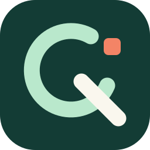

# Brand Assets

[Back to the README](../README.md)

The mark is an open query loop shaped into a Q. A detached coral block suggests
an option generated from an API; the cream tail makes the symbol readable at small sizes.
The visual identity is intentionally independent of the React and TanStack logos.

| Asset                                        | Purpose                            | ViewBox    |
| -------------------------------------------- | ---------------------------------- | ---------- |
| [logo.svg](logo.svg)                         | App icon, avatar, small mark       | 256 x 256  |
| [readme-hero.svg](readme-hero.svg)           | README banner on light backgrounds | 1120 x 336 |
| [readme-hero-dark.svg](readme-hero-dark.svg) | README banner on dark backgrounds  | 1120 x 336 |

## Palette

| Color      | Hex       | Role                        |
| ---------- | --------- | --------------------------- |
| Deep green | `#133C35` | Symbol tile and primary ink |
| Mint       | `#B9E8CC` | Query loop                  |
| Cream      | `#FAF7EE` | Q tail and light canvas     |
| Coral      | `#F38466` | Option block                |

Use the square symbol at 24 px or larger. Keep its proportions and colors intact,
with clear space of at least one eighth of the symbol width. The hero has its own spacing.
Avoid placing the bare symbol on a matching deep-green background without clear space.

All assets are self-contained SVGs, with no scripts, remote fonts, filters, or embedded bitmaps.
The icon uses paths and shapes only. Banner typography uses Avenir Next with local font
fallbacks; exact letterforms can vary by renderer. README picture sources select the
dark banner where supported and fall back to the light banner on other renderers.

Assets are covered by the repository's [MIT license](../LICENSE).
